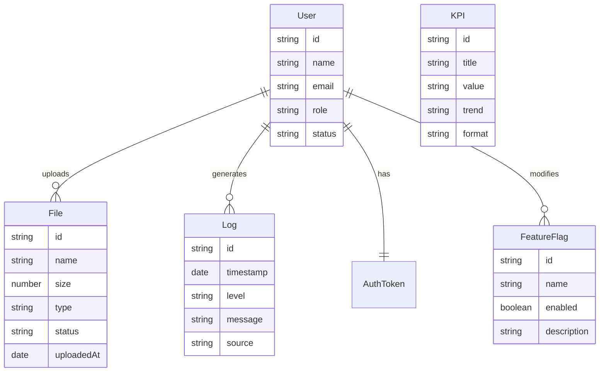

# Data Model: Dashboard Template

**Purpose**: Entity definitions and relationships for Dashboard Template
**Created**: 2026-03-23
**Feature**: Dashboard Template

## Core Entities

### User

Represents user accounts in the system.

**Attributes**:

- `id`: string - Unique identifier
- `name`: string - Full name
- `email`: string - Email address (unique)
- `role`: 'admin' | 'user' | 'viewer' - User role
- `status`: 'active' | 'inactive' | 'suspended' - Account status
- `createdAt`: Date - Account creation date
- `lastLoginAt`: Date | null - Last login timestamp
- `avatar`: string | null - Profile picture URL

**Validation Rules**:

- Email must be valid format
- Name required (min 2 characters)
- Role must be one of defined values
- Status defaults to 'active'

### File

Represents uploaded files and their processing status.

**Attributes**:

- `id`: string - Unique identifier
- `name`: string - Original filename
- `size`: number - File size in bytes
- `type`: string - MIME type
- `status`: 'pending' | 'processing' | 'done' | 'error' - Processing status
- `uploadedAt`: Date - Upload timestamp
- `processedAt`: Date | null - Processing completion timestamp
- `errorMessage`: string | null - Error details if failed
- `downloadUrl`: string | null - Download URL when complete

**Validation Rules**:

- Name required
- Size must be positive
- Status must be one of defined values
- Type required for proper handling

### Log

Represents system log entries for monitoring and debugging.

**Attributes**:

- `id`: string - Unique identifier
- `timestamp`: Date - Log entry timestamp
- `level`: 'error' | 'warn' | 'info' | 'debug' - Log level
- `message`: string - Log message
- `source`: string - Component/module that generated the log
- `userId`: string | null - User ID if user-related
- `metadata`: Record<string, any> - Additional context data

**Validation Rules**:

- Timestamp required
- Level must be one of defined values
- Message required (min 1 character)
- Source required for tracking

### KPI

Represents key performance indicators for dashboard display.

**Attributes**:

- `id`: string - Unique identifier
- `title`: string - KPI display title
- `value`: number | string - Current value
- `previousValue`: number | string | null - Previous period value
- `trend`: 'up' | 'down' | 'stable' | null - Trend direction
- `unit`: string | null - Unit of measurement
- `format`: 'number' | 'currency' | 'percentage' | 'text' - Display format
- `category`: string - KPI category/group
- `updatedAt`: Date - Last update timestamp

**Validation Rules**:

- Title required
- Value required
- Format must be one of defined values
- Category for grouping

### FeatureFlag

Represents toggleable features for dynamic module control.

**Attributes**:

- `id`: string - Unique identifier
- `name`: string - Flag name (unique)
- `enabled`: boolean - Current state
- `description`: string - Human-readable description
- `category`: string - Feature category
- `requiredRole`: 'admin' | 'user' | 'viewer' | null - Minimum role to toggle
- `updatedAt`: Date - Last modification timestamp
- `updatedBy`: string | null - User who last modified

**Validation Rules**:

- Name required and unique
- Description required
- Category for organization
- Required role validation

## Authentication State

### AuthToken (Mock)

Represents authentication token for session management.

**Attributes**:

- `token`: string - JWT-like token string
- `userId`: string - Associated user ID
- `expiresAt`: Date - Token expiration
- `issuedAt`: Date - Token issuance timestamp
- `permissions`: string[] - User permissions/roles

## Data Relationships



## State Transitions

### File Status Flow

```
pending → processing → done
pending → processing → error
```

### User Status Flow

```
inactive → active
active → inactive
active → suspended
suspended → active
```

## Mock Data Generation Rules

### Users

- Generate 10-50 mock users
- Mix of roles (70% user, 20% admin, 10% viewer)
- Realistic names and emails
- Various status distributions

### Files

- Generate 20-100 mock files
- Various file types (images, documents, data)
- Mixed status distribution
- Realistic file sizes

### Logs

- Generate 100-1000 mock logs
- Time-based distribution (recent logs more frequent)
- Various levels and sources
- Realistic error messages

### KPIs

- Generate 5-15 KPIs
- Various categories (users, files, system, performance)
- Realistic values and trends
- Regular update patterns

## API Contract Patterns

### Standard Response Format

```typescript
interface ApiResponse<T> {
  data: T
  success: boolean
  message?: string
  timestamp: Date
}
```

### Paginated Response

```typescript
interface PaginatedResponse<T> {
  data: T[]
  pagination: {
    page: number
    limit: number
    total: number
    totalPages: number
  }
  success: boolean
}
```

### Error Response

```typescript
interface ErrorResponse {
  success: false
  error: {
    code: string
    message: string
    details?: any
  }
  timestamp: Date
}
```
